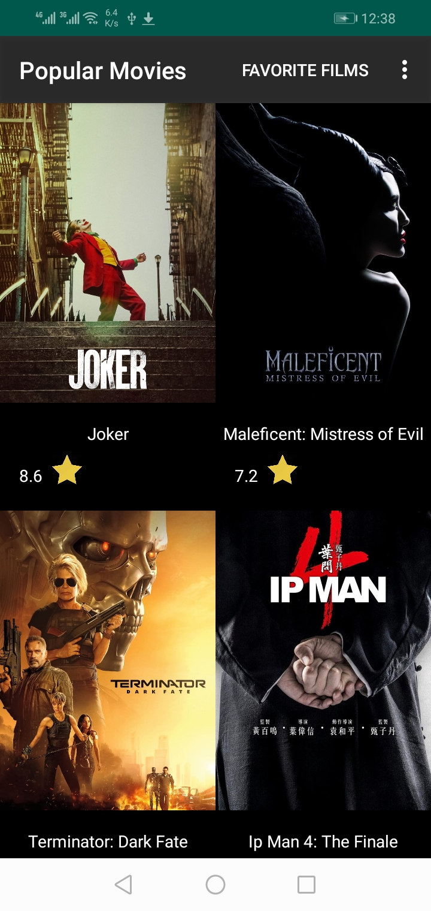
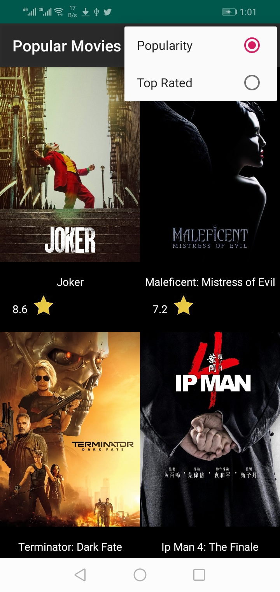
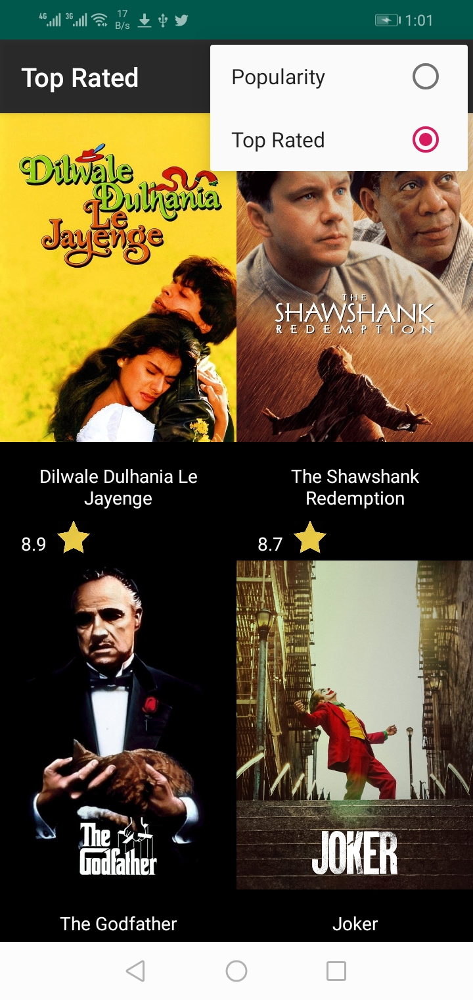
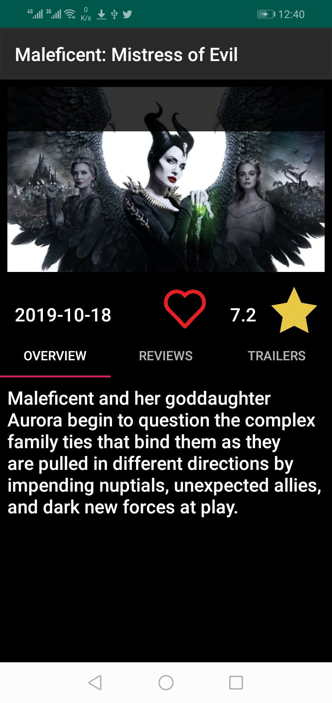
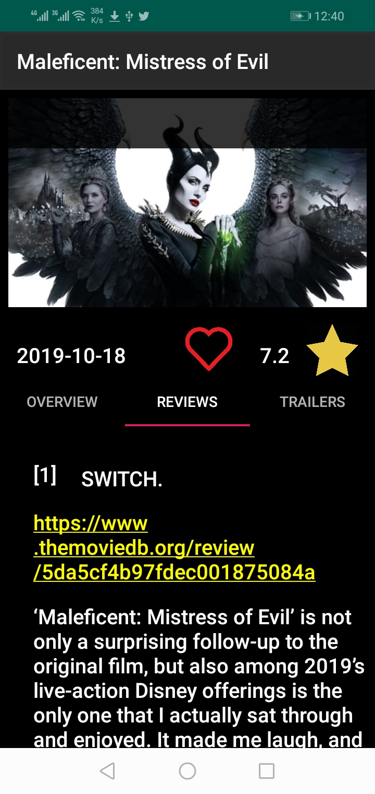
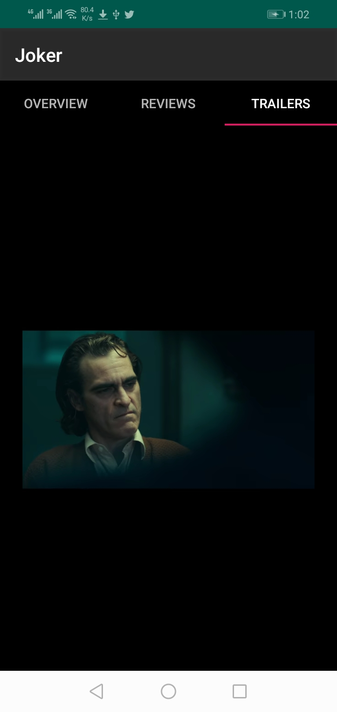
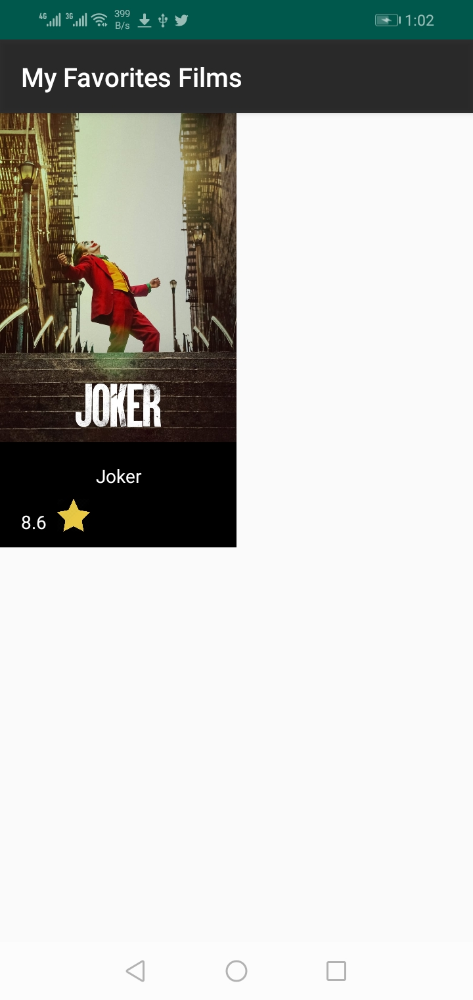

# PopularMoviesApp

Hi,welcome to my repository:) this project is intended for learning not profiting.
this is my first complete project. 
in this project i learn about android designing and developing .
the idea of the is from udacity Nanodegree course. 
i learnt about designing layouts and handle different screen sizes. 
i have used external libraries like retrofit library to connect to TMDB API to get data and Picasso fro loading images. 
i have used  sqLite for storing data.
i have used Room library for connecting with database.
i have used Architecture Components like ViewMode and Livedate.

my app screenshots

